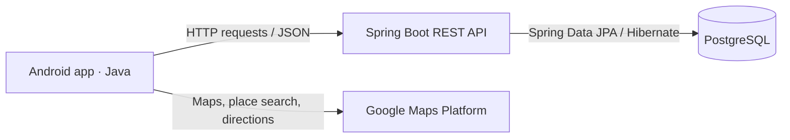

# Ulide

**Ultimate Lisbon Guide** — an Android application for discovering Lisbon's tourist attractions, exploring routes on a map, and keeping a personal record of favorite and visited places.

Ulide combines a Java Android client with a separate Spring Boot REST API and PostgreSQL database. This repository contains the mobile application, database scripts, design diagrams, and original academic documentation.

## Overview

The project was developed in 2021 as a third-semester Computer Engineering project at **IADE — Faculdade de Design, Tecnologia e Comunicação**. It brought together mobile development, object-oriented programming, and relational database design.

Its intended audience is people planning a visit to Lisbon who want to discover attractions and organize them into routes. In the application, a **spot** is an individual place of interest, while a **route** groups several spots into an itinerary.

This fork preserves the original project and its history. It is an academic prototype with an older build environment and external-service configuration; see [Installation and running](#installation-and-running) before attempting a local build.

## Contents

- [Features](#features)
- [Architecture](#architecture)
- [Technology stack](#technology-stack)
- [Repository structure](#repository-structure)
- [Backend and API](#backend-and-api)
- [Database and design](#database-and-design)
- [Installation and running](#installation-and-running)
- [Project status and limitations](#project-status-and-limitations)
- [Documentation](#documentation)
- [Contributors and attribution](#contributors-and-attribution)

## Features

The current source includes the following user-facing flows:

| Feature | Application behavior |
|---|---|
| Accounts | Register a user and sign in through the backend. |
| Home map | Explore a Google map centered on Lisbon, with markers for spots recorded as visited by the current user. |
| Route discovery | Browse routes and their average evaluation scores, ordered by the backend. |
| Route exploration | View a route's spots as map markers and a horizontal list; select a place to focus the map or open its details. |
| Route visualization | Request directions between consecutive spots and draw the returned paths, with distance and travel-time information for the returned segment. |
| Spot details and favorites | Read a place's description, tags, ratings, comments, and externally hosted image; add or remove a favorite spot. |
| Personal profile | Read profile information and expandable lists of favorite, evaluated, commented-on, and completed routes and spots. |
| Create spots | Submit a place name and coordinates, either entered manually or obtained from the device's GPS. |
| Create routes | Select places through Google Places autocomplete, create missing spots, and save a route with its spot associations. |

These descriptions reflect the checked-in implementation, not a claim that every flow has been tested against a currently running service. The December 2021 report and user manual predate some additions, including spot-favorite actions and route creation. Planned features in those documents should not all be treated as implemented.

## Architecture



- **Android client:** activities and fragments render screens, manage navigation, request location access, and display API responses. Most application requests use the custom `downloaders/` classes built on `AsyncTask` and `HttpURLConnection`. The directions flow uses Retrofit and Gson.
- **Spring Boot API:** controllers expose application resources under `/api`. JPA entities, repositories, and native SQL queries handle persistence, catalog queries, ratings, favorites, and user-related records.
- **PostgreSQL:** stores application data and relationships. The Android client accesses it through the API, not through a direct database connection.
- **Google Maps Platform:** provides the map, Places autocomplete, and directions. These integrations are called by the mobile application separately from Ulide's backend.

For example, selecting a route loads `/api/routes/{id}/spots`. The app turns the returned coordinates into markers and list items. Starting that route requests directions for successive coordinate pairs and renders their polylines. This is route visualization; the code does not establish a complete turn-by-turn navigation or automatic visit-tracking system.

## Technology stack

### Mobile

- **Java** and Android XML layouts; Java source/target compatibility is set to **8**.
- **Android SDK:** minimum API **26**, compile/target API **31**.
- **Android Gradle Plugin 7.0.3** and the bundled **Gradle 7.0.2** wrapper.
- **AndroidX**, Material Components, Navigation, View Binding, RecyclerView, and lifecycle components.
- **Google Maps SDK**, **Places SDK 2.5.0**, Google Maps Android utilities, and the Directions web service.
- **Retrofit 2.5.0 / Gson converter** for directions; `HttpURLConnection` and `org.json` for most backend calls.

The build also includes Mapbox SDK 9.1.0 and related experimental screens, plus image/UI dependencies such as Glide. The main navigation flow uses Google Maps. Several dependencies are declared more than once; the build files are the authoritative record of those declarations.

### Backend and database

- **Java**, with Java **11** declared in the backend POM and deployment runtime file. The POM also contains explicit compiler source/target settings of 8.
- **Spring Boot 2.5.6**, Spring Web, and Spring Data JPA/Hibernate.
- **Maven**, with a bundled wrapper targeting **3.8.3**.
- **PostgreSQL** and the PostgreSQL JDBC driver. A database server version is not pinned in the repository.

## Repository structure

```text
Ulide/
├── Android/
│   ├── Ulide/                       Main Android Studio / Gradle project
│   │   ├── app/src/main/
│   │   │   ├── java/com/example/ulide/
│   │   │   │   ├── MainActivity.java
│   │   │   │   ├── ui/              Screens, adapters, maps, and route flows
│   │   │   │   ├── data/            Login data source and repository
│   │   │   │   ├── downloaders/     HTTP, JSON, and image helpers
│   │   │   │   └── models/          Directions response models and helpers
│   │   │   ├── res/                Layouts, navigation, strings, and assets
│   │   │   └── AndroidManifest.xml
│   │   ├── app/src/debug/           Debug Google Maps key resource
│   │   ├── app/src/release/         Release Google Maps key resource
│   │   ├── app/build.gradle         SDK levels, flavors, and dependencies
│   │   └── gradle/wrapper/          Gradle wrapper configuration
│   └── Ulide2/                      Historical build outputs / local metadata
├── Base de dados/                   SQL schema, sample data, queries, and DB design
├── Poo/                             Class diagram and REST documentation
├── Relatorios/                      Project reports and illustrated user manual
├── Apresentacoes/                   Presentation versions and project poster
├── Logo/                            Original project branding
└── README.md
```

Open **`Android/Ulide`** as the Android project. `Android/Ulide2` does not contain a complete alternative Gradle source project. The backend source lives in a separate repository.

## Backend and API

The companion backend is [Leonerdo15/SpringBoot-Ulide](https://github.com/Leonerdo15/SpringBoot-Ulide). It provides the data consumed by the Android application and must be configured and run separately.

| Resource family | Main responsibilities |
|---|---|
| `/api/users` | User records, registration, and credential lookup for login |
| `/api/routes`, `/api/spots` | Catalog queries, details, route-to-spot queries, aggregate ratings, and user-specific lists |
| `/api/routesSpots` | Associations between routes and spots |
| `/api/favRoutes`, `/api/favSpots` | Favorite associations |
| `/api/routesEvaluations`, `/api/spotsEvaluations` | Ratings and comments, including queries by user |
| `/api/tags`, `/api/tagTypes` | Tags and tag categories |
| `/api/typeUsers`, `/api/achievements`, `/api/userAchievements` | User types and achievement records |

The [REST documentation](Poo/Documentacao_REST_v2.pdf) contains resource descriptions, request paths, JSON examples, and error responses. It is a historical reference: compare examples with the backend controllers when integrating, since some paths and capabilities changed after the document was written.

The Android source contains repeated references to the historical `ulide.herokuapp.com` host rather than a single configurable API base URL. Configure those references for your own backend as described below; the original deployment is not assumed to be available.

## Database and design

The relational model centers on `users`, `spots`, and `routes`. Association tables connect routes to spots and users to favorites, completed visits, evaluations, tags, and achievements. Spot coordinates are stored as numeric latitude/longitude columns. This project does not declare a PostGIS requirement.

Useful design resources:

- [Database diagram — PDF](Base%20de%20dados/Diagrama_base_de_dados.pdf)
- [Database documentation and data dictionary — PDF](Base%20de%20dados/Documenta%C3%A7%C3%A3o%20de%20Base%20de%20Dados.pdf)
- [Original editable class diagram](Poo/Diagrama_de_Classes.drawio)

The diagrams describe the original design rather than an exact current schema. For example, the database diagram includes photo-related entities that are absent from the supplied SQL schema scripts; the Android detail screen instead downloads images through historical short links.

<details>
<summary>View the original class diagram</summary>


[Open the class diagram at full size](Poo/Diagrama_de_Classes.png).

</details>

## Installation and running

The following describes a local development setup derived from the repositories. **The application was not built or run as part of this documentation update.** Database preparation, legacy dependency resolution, and Google service access need to be checked in your environment.

### 1. Prepare the tools and clone the repositories

You need Git, an Android Studio installation compatible with the recorded Gradle/AGP versions, Android SDK Platform 31, an API 26-or-newer device or emulator with Google Play services, PostgreSQL with its command-line tools, and a **JDK 11** installation.

Set Android Studio's Gradle JDK and your terminal's `JAVA_HOME` appropriately. JDK 11 is the historical build baseline for [AGP 7.0](https://developer.android.com/build/releases/agp-7-0-0-release-notes); the project's Java 8 source level is a separate setting. A current Android Studio installation may require deliberate compatibility adjustments rather than an automatic upgrade of all build files.

Clone the mobile fork and backend into sibling directories:

```bash
git clone https://github.com/Leonerdo15/Ulide.git
git clone https://github.com/Leonerdo15/SpringBoot-Ulide.git
```

### 2. Prepare the PostgreSQL database

The SQL files are historical versions, not a migration chain:

| File | Setup implications |
|---|---|
| `create_tables_ulide_v1.sql` | Creates 17 tables in dependency order, including `done_spots`, but lacks the later login columns. |
| `populate_ulide_v1.sql` | Older sample data; review it against your chosen schema before use. |
| `creates_populates_ulide_v2.sql` | Includes login columns and later sample data, but creates some foreign-key dependents before their referenced tables and omits `done_spots`. It cannot bootstrap an empty database unchanged. |
| `Queries.sql` | Query examples, not an installation script. |

One source-derived starting point for a **new, empty development database** is to import v1 and add the login columns defined in v2. The following uses an example database name, `ulide`; replace `YOUR_DB_USER` with an existing local PostgreSQL role authorized to create it.

From the cloned `Ulide` repository root:

```bash
createdb -h localhost -U YOUR_DB_USER ulide
psql -h localhost -U YOUR_DB_USER -d ulide -v ON_ERROR_STOP=1 -f "Base de dados/create_tables_ulide_v1.sql"
```

Then run this SQL in that database **before populating `users`**:

```sql
ALTER TABLE users
    ADD COLUMN us_username varchar(20) NOT NULL,
    ADD COLUMN us_password varchar(60) NOT NULL;

CREATE UNIQUE INDEX users_us_username_uindex ON users (us_username);
```

This is a documented adaptation of the two snapshots, not a migration shipped with the project. Add reviewed local fixtures in foreign-key order: user/tag types, users, spots and routes, then their associations and evaluations. The schema's default user type is ID `2`, while route-creation code writes a placeholder evaluation for user ID `1`; account for those assumptions in development fixtures.

Do not run the v2 dump over the v1 schema: its table definitions would conflict. If reusing selected historical inserts with explicit IDs, reset the affected serial sequences before testing new records. The snapshots do not include those resets. Historical account values should be replaced with your own non-sensitive test data.

Also note that **Find Routes** uses `/api/routes/avg`, whose SQL joins routes to evaluations. A route without evaluation rows does not appear in that list even if it exists in `routes`.

### 3. Configure and start the Spring Boot backend

In the `SpringBoot-Ulide` directory, supply your own database configuration. Its tracked `src/main/resources/application.properties` contains historical connection settings; do not reuse those credentials.

Spring Boot supports [environment variables overriding packaged properties](https://docs.spring.io/spring-boot/docs/2.5.6/reference/html/features.html#features.external-config). Set all three datasource variables in the same terminal that launches the backend. The username/password below are placeholders to replace with your local credentials.

**Windows PowerShell:**

```powershell
$env:SPRING_DATASOURCE_URL = "jdbc:postgresql://localhost:5432/ulide"
$env:SPRING_DATASOURCE_USERNAME = "YOUR_DB_USER"
$env:SPRING_DATASOURCE_PASSWORD = "YOUR_DB_PASSWORD"
$env:SERVER_PORT = "8080"
.\mvnw.cmd spring-boot:run
```

**macOS / Linux:**

```bash
export SPRING_DATASOURCE_URL='jdbc:postgresql://localhost:5432/ulide'
export SPRING_DATASOURCE_USERNAME='YOUR_DB_USER'
export SPRING_DATASOURCE_PASSWORD='YOUR_DB_PASSWORD'
export SERVER_PORT=8080
sh ./mvnw spring-boot:run
```

The supplied Maven wrapper downloads its configured Maven distribution. Database schema creation is a separate step; the repository does not provide an automatic migration toolchain.

Once the backend starts, check a catalog resource from the development machine:

```bash
curl http://localhost:8080/api/spots
```

An empty JSON array is expected if the schema exists but no spots have been added. Application startup alone does not verify all endpoints or database relationships.

### 4. Configure the Android API address

Open `Android/Ulide` in Android Studio. Let the IDE configure your local SDK path in `local.properties`; another contributor's machine-specific path is not portable.

Search the Java source under `app/src/main/java/com/example/ulide` for **`https://ulide.herokuapp.com`** and replace every application API origin with the address of your own backend. Keep the existing `/api/...` paths. References appear in the login data source and several screen classes; changing only one file is insufficient.

| Run target | Example backend origin |
|---|---|
| Standard Android Emulator, backend on the host computer | `http://10.0.2.2:8080` |
| Physical device | Your development machine's reachable LAN address and port, or your configured HTTPS hostname |

The emulator's `10.0.2.2` address is an alias for the host computer's loopback interface; `localhost` inside the emulator refers to the emulator itself. See [Android's networking reference](https://developer.android.com/studio/run/emulator-networking-address).

**Local HTTP needs an explicit debug configuration.** The app targets API 31 and does not currently opt into cleartext HTTP. If using the local HTTP example, create `app/src/debug/AndroidManifest.xml` in your working copy with:

```xml
<manifest xmlns:android="http://schemas.android.com/apk/res/android">
    <application android:usesCleartextTraffic="true" />
</manifest>
```

Keep this exception in the debug source set and use test accounts. For HTTPS, configure a certificate trusted by the device. See [Android network security configuration](https://developer.android.com/privacy-and-security/security-config). Physical-device access also depends on your local network and firewall configuration.

### 5. Configure maps, Places, and directions

Supply your own Google Maps Platform configuration and suitable API restrictions. The existing code uses separate key locations:

| Location inside `Android/Ulide` | Purpose |
|---|---|
| `app/src/debug/res/values/google_maps_api.xml` | `google_maps_key` for debug map rendering |
| `app/src/release/res/values/google_maps_api.xml` | Corresponding release map resource |
| `app/src/main/java/com/example/ulide/MainActivity.java` | Key passed to `Places.initialize(...)` |
| `app/src/main/java/com/example/ulide/ui/starRoute/StartRouteFragment.java` | Key passed to the Directions web-service request |

Updating only the XML resource does not configure Places or directions. For Android-restricted keys, match the chosen variant's application ID and signing certificate: the `gms` flavor uses **`com.example.ulide.gms`**. The top-level build declares the Maps secrets plugin, but the app module does not apply it; adding a key to `local.properties` alone will not replace the existing key usages.

The old Places integration and `/maps/api/directions/json` endpoint use legacy Google services. New Cloud projects may require a code migration to the current APIs rather than simply a new key; check [Google's legacy-service guidance](https://developers.google.com/maps/legacy) for access and migration requirements.

Spot images are fetched through `bit.ly/ulidespot` links constructed with a spot ID in `SpotFragment.java`. They are separate from backend data and may need replacement for your own catalog.

### 6. Build and run the Android app

1. Install SDK Platform 31 and the build tools requested by Gradle through Android Studio's SDK Manager.
2. Select the **`gmsDebug`** build variant. The alternative `v3` flavor references `places-maps-sdk-3.1.0-beta.aar`, which is not included in the repository.
3. Sync Gradle and resolve any legacy repository/dependency errors. The project references JCenter/Bintray-era repositories and mixes duplicated Maps and older support-library declarations; successful resolution on a modern installation is not guaranteed.
4. Start the configured backend, then run the `app` configuration on an emulator or connected device with Google Play services and internet access.
5. Register a local test account or use one you created in your development database. Grant location permission when testing **Use My Location**, and provide a location fix on an emulator.

The corresponding debug build commands, from `Android/Ulide`, are:

```powershell
# Windows PowerShell
.\gradlew.bat :app:assembleGmsDebug
```

```bash
# macOS / Linux
sh ./gradlew :app:assembleGmsDebug
```

These commands reflect the checked-in module/flavor configuration; they have not been validated by a successful build during this documentation review.

## Project status and limitations

- **Historical setup:** the build files, database snapshots, and cloud integrations require the adjustments above. There is no verified one-command installation or bundled backend deployment.
- **Feature scope:** profile editing, a complete review-submission interface, automatic visit tracking, and the broader recommendation/filtering ideas in the report are not established as finished mobile flows. Route creation and spot favorites are present in the later source but still require integration testing.
- **Route behavior:** the directions view processes consecutive pairs, and its displayed distance/time is overwritten by individual responses rather than accumulated into a reliable itinerary total. Route creation also assumes a placeholder user and evaluation.
- **Network handling:** several screens block on asynchronous tasks and assume successful responses. Service outages and empty data can cause failures rather than a polished offline experience.
- **Authentication:** the prototype places login credentials in a URL path, compares stored password values directly, and exposes user objects without a production authentication/authorization layer. Use isolated test data until those mechanisms are redesigned. Replace exposed connection credentials and API keys before reuse; no credential values are reproduced here.
- **Tests:** the Android tests are template checks, and the backend contains a context-loading test. They do not establish end-to-end feature coverage. The Android package-name assertion also predates the flavor suffixes.

## Documentation

The original Portuguese-language documents are retained in this fork. They provide project context, historical screenshots, design rationale, and example API usage.

| Resource | What it contains |
|---|---|
| [Full project report / usage scenarios](Relatorios/Projeto_Mobile_Final.pdf) | Academic context, objectives, intended users, usage scenarios, and the December 2021 implementation report |
| [Illustrated user manual](Relatorios/Manual%20do%20Utilizador.pdf) | Screen-by-screen guide to login, profile, maps, routes, spots, and spot creation |
| [Class diagram](Poo/Diagrama_de_Classes.png) | Original domain classes and relationships; [editable source](Poo/Diagrama_de_Classes.drawio) |
| [Database diagram](Base%20de%20dados/Diagrama_base_de_dados.pdf) | Original relational design |
| [Database documentation](Base%20de%20dados/Documenta%C3%A7%C3%A3o%20de%20Base%20de%20Dados.pdf) | Data dictionary, field definitions, and constraints |
| [REST API documentation](Poo/Documentacao_REST_v2.pdf) | Resource endpoints, request/response examples, and error cases |
| [Final presentation version](Apresentacoes/Ulide_v3.pdf) | Project presentation material |
| [Spring Boot backend](https://github.com/Leonerdo15/SpringBoot-Ulide) | Controllers, JPA models/repositories, Maven configuration, and server settings |

## Contributors and attribution

Ulide was developed by **Felipe Campelo Sabbado** and **Leonardo Lage**, as credited in the original report and user manual. This repository is a fork of [felipesabbado/Ulide](https://github.com/felipesabbado/Ulide) and preserves its commit history and existing contributor attribution. The documentation update does not reassign authorship or individual project roles.

No explicit project-wide license file is provided. Some incorporated Google sample files carry their own Apache 2.0 notices; those notices remain applicable to those files and do not establish a license for the entire project.
